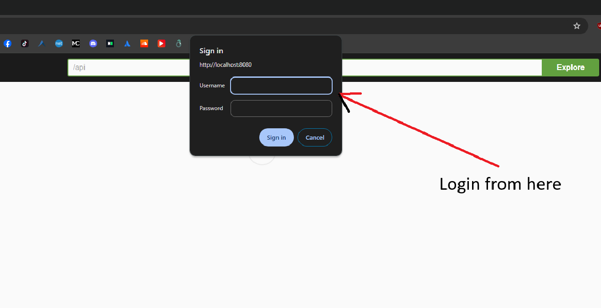

# Application description:

This is a web service for managing users, following the principles of REST.
The API allows you to perform basic CRUD operations  on user information. 
The API security is ensured with Spring Security using basic authentication.
The API documentation is described with Swagger.

#### Sample init data is provided in `src/main/resources/data.sql`  

### `INSERT INTO users (username, password, role) VALUES ('superuser', 'password', 'ADMIN');`  

### `INSERT INTO users (username, password, role) VALUES ('user', 'password', 'USER');`

# What can be improved:

* Use JWT Authentication instead of Basic Auth
* Use latest version of Spring Boot and Spring Security with Java 17

# How to run the application using Docker:

1. Run **gradle build** task
2. From `prj-user-management` directory run the following: `docker build -t user-management:latest .`
3. Run the following: `docker run -p 8080:8080 user-management`
4. Go to `http://localhost:8080/swagger-ui/index.html#/` and navigate through swagger search bar to `/api`.

# Tech Stack

* Java 11
* Spring Boot
* Spring Security
* Spring Data JPA
* Swagger
* H2
* Docker

## Additional Notes:

* **Initial** authentication on Swagger could not be configured correctly due to basic authentication,
for **initial** authentication please apply credentials in following dialog box offered by browser, then you can play with Swagger auth, may lead to auth inconsistencies.   
* For better api usage `Postman` is preferred.